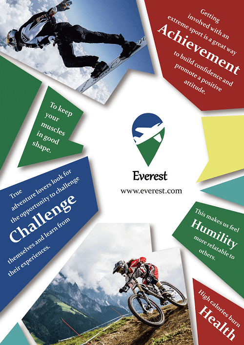

# One_Page_Traveling_Website_2nd

To optimize the website user interface, user experience, animation, and add RWD Based on the [One_Page_Traveling_Website_1st](https://github.com/yschen25/One_Page_Traveling_Website_1st).
 

## Description

         
According to the increment of smartphone usage rates, this website is designed to be a <b><i>one/single page</i></b> web, there are no additional pages, users can just click the navigation links then slide to the destinations on the page, or they can just scroll down to the different sections as they want.

Compared to the multipage website design, **_one/single page_** website making the user experience more intuitive and smooth.

 

## Author

* **:octocat: Programmer : [ME](https://github.com/yschen25)**
        
        * HTML、CSS、JavaScript、jQuery
         
* **:octocat: Ui/Ux Designer : [ME](https://github.com/yschen25)**
        
        * Using Photoshop and illustrator

* **:octocat: Project Manager : [ME](https://github.com/yschen25)**

        * The whole web struture and function
 

## Website Planning

[Website Planning](https://tinyurl.com/y7lkxdmo)
 
Introducing the website concept, logo design, fonts and colors settings, structure, PC and mobile wireframes, PC and mobile website screenshots, references.
 
 

## Demo

### **[ONE PAGE TRAVELING WEBSITE](https://yschen25.github.io/One_Page_Traveling_Website_2nd/) -> Where You Can See This Website**

 
 
 

1. PC demo  

   

 

2. PC popup demo 

   

 

3. Mobile demo 

   

 

## Poster
 
The poster design for the website, use irregular shapes to express the unlimited attitude.

   

 

## Update

* **2018.09.14**

         * Adding meta tags
         * Resizing, reducing and deleting the pics
         * Optimizing user interface
         * Optimizing RWD
         * Fixing an image doesn't show in IE
         * Sorting out html, css, js

* **2018.10.03**

         * Adding website link and QR Code
         * Changing readme content and meta tags          
 

## QR Code Generator
Using [IOI QR Code Generator](https://qr.ioi.tw/zh/).
 
 

## Demo Editor Tools
Using [ScreenToGif](http://www.screentogif.com/) to record, [ezGIF](https://ezgif.com/) to edit and [imgur](https://imgur.com/) to upload gifs.
